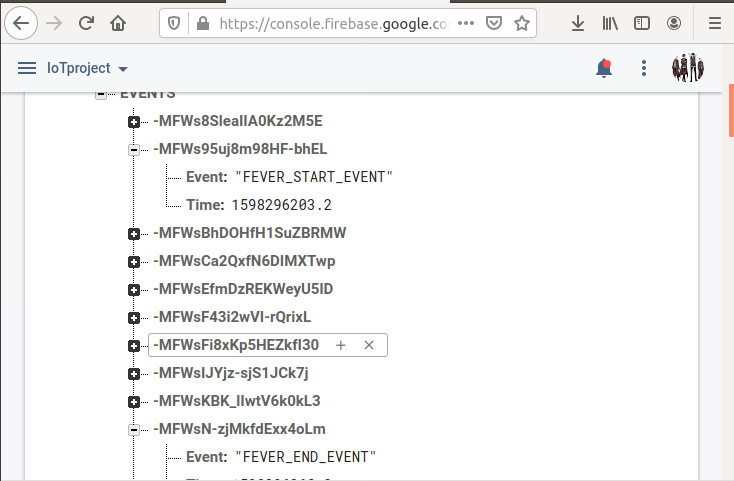

## Members
Baciu Dragos Marian, Fitou Robert Claudiu
<br><br><br>


## Table of Contents
1. [ Quickstart ](#quickstart)
2. [ Project setup](#proj-setup)

<br><br>

<a name="quickstart"></a>
## Quckstart
```sh
$ . venv.sh
$ pip3 install requirements.txt
$ ./fix_firebase_modules.sh # ONLY RUN THIS LINE IF YOU ARE USING python3.7 AND ABOVE
$ ./coremodule.py -s -f <FIREBASE_URL>
$ ./api.py
```
<br><br>

<a name="proj-setup"></a>
## Project setup
- __coremodule.py__ - Core module of the project, which is responsible for reading temperature (from senor or
    generates random values) and storing it to database, writes events in Firebase and graphs temperature data
    using Plotly.
- __api.py__ - Web API running on local host on port 5051 with endpoints for fever and temperature.
- __database.py__ - Sqlite3 databse module which is used by both __coremodule.py__ and __api.py__ .
- __fix_firebase_modules.sh__ - Fixes some issues related to Firebase module. Only needed to run if you are using
    python3.7 and above because "async" became a keyword in python3.7.
- __venv.sh__ - Installs `virtualenv` python module and activates the virtual environment.
- __requirements.txt__ - pip3 requirements file
<br><br>

**coremodule.py** :

- Writes events in firebase. Receives the events and the current time and while it is an event will be writen along with the current time, in firebase . ***Change `FirebaseApplication` url to your own url***.

- Graphs temperatures using Plotly.It receive temperature and time and draw an dashed graph using them.Generated plotly file is called **test.html**


